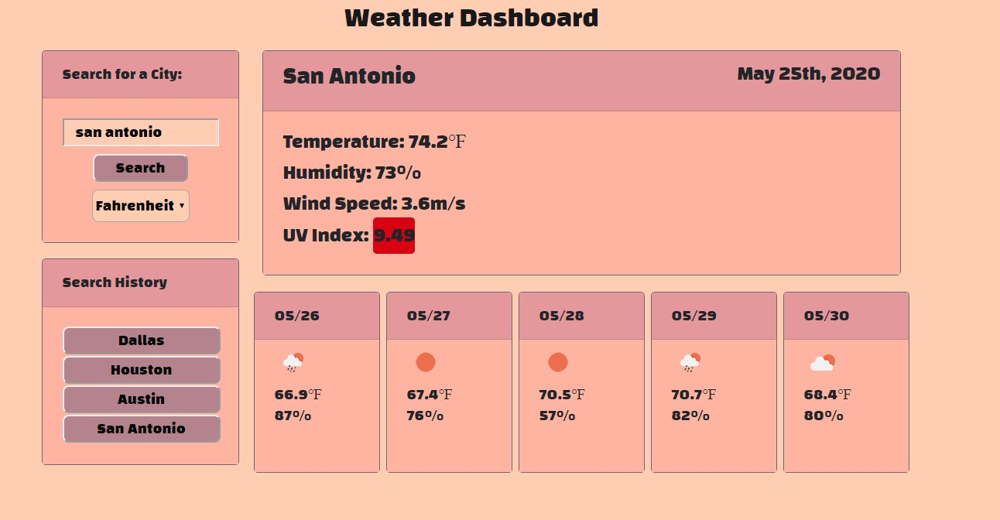

# Weather Dashboard
An application that displays current weather information for any city in the world, as well as a five-day forecast. Information displayed is temperature, date, humidty, wind speed and UV Index. The UV Index is color coded to indicate severity.

## Installation 
Runs in your browser.

## Usage
For travelers going to another city who need to prepare for the coming weather. Type any city name in the world into the search input field. Click the search button. The upper-right card will display the City Name, Current Date, Temperature (defaults to Fahrenheit), Humidity, Wind Speed and UV Index. The UV Index is color-coded for severity. The lower-right cards display Temperature, Humidty and Wind Speed for the coming five days. The toggle switch in the upper-left can change outputs to Celsius. The bottom-left card creates buttons to go back to a previously searched city's results. Upon page load the app will display results from the most recently searched city. A first-time load will show results for the closest city near the user's location determined by their IP address.

## Screenshot

## Link
<a href="https://jack-aaron.github.io/Weather-Dashboard/">Deployed Application</a>

## License
This application is under the MIT license.

## How You Can Contribute
This is a course assignment and does not need any contribution.
